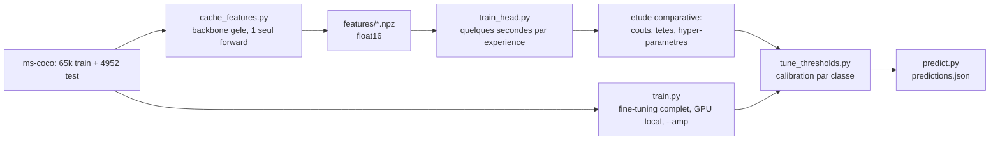

# Partie 4 — Le programme d'entraînement et de validation

La partie 4 du sujet donne le squelette attendu du programme principal. Ce
document met chaque section du squelette en correspondance avec notre code, et
justifie les choix faits.

L'ancienne machine de développement n'avait pas de GPU, d'où deux programmes
d'entraînement complémentaires. Les deux tournent maintenant en local
(NVIDIA RTX 4060 Ti, Intel i9-13900KF, 32 Go de RAM).

---

## 4.0 Pourquoi deux programmes

Débits mesurés par [`scripts/benchmark_speed.py`](../scripts/benchmark_speed.py)
sur l'ancienne machine (Intel i5-1135G7, 4 cœurs / 4 threads PyTorch, pas de
GPU), en 224 px :

| Backbone | GFLOPS | Forward | Entraînement | Cache des 70 k images | 1 époque (52 k) |
| --- | --- | --- | --- | --- | --- |
| mobilenet_v3_small | 0,06 | 271 img/s | 71 img/s | 4 min | 12 min |
| mobilenet_v3_large | 0,22 | 78 img/s | 23 img/s | 15 min | 38 min |
| resnet18 | 1,81 | 50 img/s | 17 img/s | 23 min | **50 min** |
| resnet50 | 4,09 | 17 img/s | 5,6 img/s | 68 min | **2 h 34** |

Le décodage JPEG et les transformations tournent à 1 161 img/s par worker : ce
n'est jamais le goulot, c'est bien le calcul du réseau qui limite.

Sur cette ancienne machine, un fine-tuning ResNet18 de 10 époques coûterait
8 heures, et une étude comparative de plusieurs architectures était hors de
portée. La séparation reste utile sur la RTX 4060 Ti : le cache de features
rend les expériences de tête presque gratuites, et le fine-tuning complet met
à jour tout le réseau.



- **`train_head.py` (extraction de features)** — le backbone pré-entraîné est
  gelé, donc ses sorties ne dépendent pas de l'apprentissage. Un seul passage
  forward sur le dataset suffit, et chaque expérience de tête se mesure ensuite
  en secondes. C'est ce qui rend l'étude comparative des têtes rapide.
- **`train.py` (fine-tuning)** — met à jour tout le réseau. Plus performant. Se
  lance en local, avec `--amp` :

```bash
python3 scripts/train.py --model resnet50 --epochs 10 --loss asl --amp
```

Les deux produisent des checkpoints compatibles avec `tune_thresholds.py` et
`predict.py`, et écrivent dans le même registre `outputs/experiments.csv`.

---

## 4.1 Le squelette du sujet, section par section

### Imports et variables globales

Les hyperparamètres par défaut sont centralisés dans `DEFAULTS`
([`config.py`](../src/coco_mlc/config.py)) et surchargeables en ligne de
commande. Aucune constante n'est dupliquée entre les scripts.

### Initialisation du device

`engine.pick_device()` renvoie `cuda` si disponible, sinon `cpu`.
`describe_device()` affiche le nom du GPU ou le nombre de threads, trace utile
dans les journaux d'expériences.

### Initialisation des répertoires de données

`PATHS` ([`config.py`](../src/coco_mlc/config.py)) dérive tous les chemins d'une
racine unique, surchargeable par la variable d'environnement `MSCOCO_ROOT`. Le
code suit le dataset sans modification, où qu'il soit installé.
`PATHS.check()` échoue immédiatement avec un message explicite si la structure
attendue est absente.

### Transforms, datasets et data loaders

```python
train_tf = build_transforms(image_size, train=True,  resize_mode="pad", augment="flip")
val_tf   = build_transforms(image_size, train=False, resize_mode="pad")
```

- **Normalisation** : moyennes et écarts-types ImageNet. Obligatoire pour que les
  poids pré-entraînés soient dans leur régime de fonctionnement.
- **Géométrie** : `pad` par défaut (voir [partie 3](03-outils-et-evaluation.md#30-le-dataset-réel)).
- **Augmentation** : `flip` par défaut. Le miroir horizontal est sans risque sur
  MS COCO. `strong` ajoute `ColorJitter` et `RandomAffine`. Pas de
  `RandomResizedCrop` agressif : sur des images de 224 px de grand côté, recadrer
  fait disparaître des objets dont la classe reste dans la cible, ce qui
  introduit du bruit d'étiquetage.

Le sujet suggère `random_split`. Nous utilisons `data.get_split`, qui propose la
stratification itérative multi-label et **met le découpage en cache** pour que
toutes les expériences partagent les mêmes indices
([justification en partie 3](03-outils-et-evaluation.md#34-le-découpage-train--validation)).

Trois loaders sont construits : train (avec augmentation et mélange), validation
(sans augmentation), et train-en-évaluation (**sans** augmentation). Ce
troisième loader permet de comparer train et validation sur un pied d'égalité :
si on évaluait le train avec augmentation, l'écart train/validation mélangerait
le surapprentissage et la difficulté ajoutée par l'augmentation.

### Instanciation et préparation du modèle

```python
net = build_model("resnet18", num_classes=80, pretrained=True)
```

`models.build_model` ([`models.py`](../src/coco_mlc/models.py)) charge les poids
via l'API moderne de torchvision (`ResNet18_Weights.DEFAULT`) puis **remplace la
dernière couche linéaire** par une `nn.Linear(in_features, 80)`.

La localisation de cette couche est générique : `named_modules()` parcourt le
graphe dans l'ordre de définition, donc la dernière `nn.Linear` est la tête de
classification pour toutes les familles utilisées — `fc` pour ResNet,
`classifier` pour MobileNet / EfficientNet / ConvNeXt, `heads.head` pour ViT,
`head` pour Swin. Ajouter une architecture au registre ne demande donc aucun
code spécifique.

**Le réseau renvoie des logits**, sans sigmoïde finale. Détails et liste des
candidats dans [la partie 6](06-modeles-preentraines.md).

### Instanciation du critère de perte

Quatre fonctions de coût sont comparables via `--loss`
([`losses.py`](../src/coco_mlc/losses.py)) :

| Option | Description |
| --- | --- |
| `bce` | `BCEWithLogitsLoss`. La référence : 80 problèmes binaires indépendants. |
| `bce_pos_weight` | BCE avec `pos_weight[c] = négatifs/positifs`, plafonné (défaut 20). Sans plafond, `hair drier` recevrait un poids de ~640, qui sature le gradient. |
| `focal` | Focal loss sigmoïdale (γ = 2, α = 0,25). Réduit la contribution des exemples déjà bien classés. |
| `asl` | Asymmetric Loss (γ⁻ = 4, γ⁺ = 0, clip = 0,05), référence sur MS COCO multi-label. Focalise plus fort sur les négatifs et ignore ceux déjà très bien classés. |

Pourquoi ce choix importe : avec 2,93 classes positives en moyenne sur 80, **97 %
des cibles sont des zéros**. Une BCE non pondérée pousse naturellement le réseau
vers « tout prédire négatif », qui donne une perte faible et un F1 serveur nul.

`nn.CrossEntropyLoss`, utilisée pour CIFAR-10 dans le TP, est inapplicable :
elle suppose une classe unique par image via un softmax normalisé sur les
classes. En multi-label, les classes doivent rester indépendantes, d'où une
sigmoïde par sortie.

### Instanciation de l'optimiseur

`AdamW` (lr = 1e-4 en fine-tuning, 1e-3 pour les têtes sur features), avec
`weight_decay = 1e-4` et un scheduler cosinus par défaut. AdamW plutôt que SGD :
convergence plus rapide sans recherche fine du learning rate, ce qui compte quand
le budget de calcul est le facteur limitant. Seuls les paramètres avec
`requires_grad=True` sont enregistrés, pour que `--freeze-backbone` fonctionne
sans effet de bord sur les moments de l'optimiseur.

### Chemin du meilleur modèle et métrique de sélection

Le modèle est sélectionné sur le **F1 serveur de validation au meilleur seuil
global** (`val_f1_tuned`), pas sur le F1 au seuil 0,5.

Raison : le seuil 0,5 n'est presque jamais optimal pour cette métrique, et il
l'est différemment selon l'époque (les sorties se décalent pendant
l'entraînement). Sélectionner au seuil 0,5 reviendrait à classer les époques sur
une grandeur partiellement arbitraire. La recherche du seuil global est gratuite
puisque les scores de validation sont déjà en mémoire.

### SummaryWriter Tensorboard (optionnel)

`--tensorboard` crée un `SummaryWriter` dans `runs/<nom>`, alimenté par
`engine.update_graphs`.

### Boucle sur les époques

```python
for epoch in range(epochs):
    train_loss = train_one_epoch(...)            # entraînement
    val_results, val_scores, val_targets = evaluate(...)   # validation
    best_th, f1_tuned = tune_global_threshold(val_scores, val_targets)
    if args.eval_train:
        train_results = evaluate(train_eval_loader, ...)   # validation sur le train
    update_graphs(...)                           # graphiques (optionnel)
    if f1_tuned > best_f1:                       # nouveau meilleur modèle ?
        save_checkpoint(...)                     # sauvegarde, mise à jour du score
```

L'évaluation sur le train est optionnelle (`--eval-train`) car elle double le
coût d'une époque. Elle sert à diagnostiquer sous-apprentissage et
surapprentissage, pas à sélectionner le modèle.

### Fermeture du writer, et une étape de plus

Après la boucle, le programme fait quelque chose que le squelette du sujet ne
mentionne pas mais qui est indispensable ici : il **recharge le meilleur
checkpoint, calibre un seuil par classe sur la validation et écrit ces seuils
dans le checkpoint**. Les seuils font partie du modèle : sans eux,
`predict.py` ne saurait pas quelles décisions prendre.

---

## 4.2 Utilisation

### Étude comparative en local (CPU)

```bash
# 1. Un seul passage forward par backbone (15 à 25 min)
python3 scripts/cache_features.py --model resnet18
python3 scripts/cache_features.py --model mobilenet_v3_large

# 2. Baseline, puis étude comparative des coûts et des têtes
python3 scripts/train_head.py --model resnet18
python3 scripts/train_head.py --model resnet18 --sweep

# 3. Calibration fine des seuils
python3 scripts/tune_thresholds.py --checkpoint outputs/head_resnet18_linear_asl.pth --save
```

Le `--sweep` fait varier **une seule chose à la fois** par rapport à la baseline
(tête linéaire + BCE), condition pour que les écarts soient interprétables :

| # | Tête | Coût |
| --- | --- | --- |
| 1 | linéaire | `bce` (baseline) |
| 2 | linéaire | `bce_pos_weight` |
| 3 | linéaire | `focal` |
| 4 | linéaire | `asl` |
| 5 | MLP | `bce` |
| 6 | MLP | `bce_pos_weight` |
| 7 | MLP | `asl` |

### Mesurer les débits sur cette machine

```bash
python scripts/benchmark_speed.py --models mobilenet_v3_small mobilenet_v3_large efficientnet_b0 efficientnet_b1 efficientnet_b3 resnet18 efficientnet_b4 resnet50 convnext_tiny swin_t maxvit_t efficientnet_v2_s --batch-size 32 --batches 8
```

Le script prend le GPU s'il est disponible. Il n'utilise pas `--amp` : les
débits d'entraînement sont en précision classique. Le CSV est écrit dans
`outputs/benchmark_speed.csv`.

### Fine-tuning en local

`--amp` active la précision mixte. Une seule variable change entre les runs,
pour que les écarts soient interprétables.

```bash
# Test rapide du pipeline
python3 scripts/train.py --model mobilenet_v3_small --max-images 2000 --epochs 1 --amp

# Baseline fine-tunée, à comparer à la tête sur features.
python3 scripts/train.py --model resnet18 --epochs 10 --loss bce \
    --batch-size 128 --lr 1e-4 --amp --num-workers 2 --tensorboard

# Même modèle, fonction de coût adaptée au déséquilibre.
python3 scripts/train.py --model resnet18 --epochs 10 --loss asl \
    --batch-size 128 --lr 1e-4 --amp --num-workers 2

# Backbone plus performant (poids IMAGENET1K_V2, 80,9 % top-1).
python3 scripts/train.py --model resnet50 --epochs 10 --loss asl \
    --batch-size 96 --lr 1e-4 --amp --num-workers 2 --tensorboard

# Convolution moderne, transformer, et les autres candidats du registre.
python3 scripts/train.py --model convnext_tiny --epochs 10 --loss asl \
    --batch-size 64 --lr 5e-5 --amp --num-workers 2
python3 scripts/train.py --model swin_t --epochs 10 --loss asl \
    --batch-size 64 --lr 5e-5 --amp --num-workers 2
```

Les poids ImageNet (`Weights.DEFAULT`) sont téléchargés automatiquement au
premier lancement, dans `~/.cache/torch/hub/checkpoints`.

---

## 4.3 Traçabilité des expériences

Chaque exécution ajoute une ligne à `outputs/experiments.csv` : backbone,
stratégie, tête, coût, hyperparamètres, métriques de validation, durée. S'y
ajoutent par expérience :

- `outputs/history_<nom>.csv` — métriques par époque ;
- `outputs/per_class_<nom>.json` — précision, rappel, F1, support et poids des 80
  classes, pour l'analyse d'erreurs ;
- `outputs/model_<nom>.pth` ou `head_<nom>.pth` — poids, seuils calibrés,
  statistiques de normalisation et configuration complète.

La reproductibilité est assurée par `utils.set_seed` (Python, NumPy, PyTorch), le
découpage mis en cache, et `utils.environment_summary` qui enregistre les
versions et la révision git.
